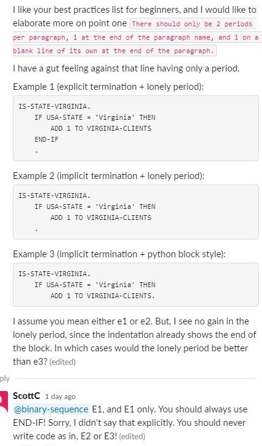

My advice, get rid of ALL unnecessary periods. They are just not necessary any more. And, more good advice for those starting out:

There should only be 2 periods per paragraph, 1 at the end of the paragraph name, and 1 on a blank line of its own at the end of the paragraph.

Always use GOBACK instead of STOP-RUN.
No need to use PERFORM THRU or EXIT paragraphs.
No need to use GOTOs. Use an IF statement and CONTINUE to check the (88-level) value of LASTREC to conditionally execute the PERFORM. Or, since you will only use 1 period within a paragraph, NEXT SENTENCE will take you to the end of the paragraph.
A READ or WRITE paragraph should be limited to just a READ of a file or WRITE of a record. Optionally, one group MOVE statement. The purpose of this type of paragraph is to be versatile enough to be able to perform it multiple times from different parts/areas of your program.
Never use NOT or only in very obvious, simple usage.